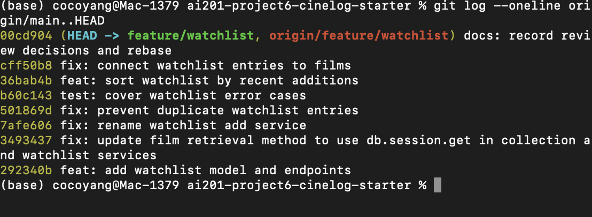

# PR Response Doc — CineLog Watchlist Feature

## AI Usage

I used Codex to help orient me to the repository, inspect the six review comments, and stress-test the reasoning behind the design decisions. I verified every suggested change against the source code and test suite before keeping it.

## Comment 1 — Rename

**What I did:** Renamed `save_to_watchlist()` to `add_to_watchlist()` in `services/watchlist_service.py` and updated its import and call site in `routes/watchlist/watchlist.py`.

**How I verified:** Searched the whole repository for `save_to_watchlist` and confirmed that no call sites remain. I also ran the full test suite.

## Comment 2 — Deduplication

**What I did:** Added an `AlreadyInWatchlistError` and made `add_to_watchlist()` query for an existing entry with the same `user_id` and `film_id` before inserting. If one exists, the service raises the domain-specific error and does not commit another row. This follows the established `add_to_collection()` pattern.

**How I verified:** Added the same film twice in an isolated test database, confirmed the second call raises `AlreadyInWatchlistError`, and confirmed only one matching row remains. I also ran the full test suite.

## Comment 3 — Missing test

**What I did:** Created `tests/test_watchlist.py` using the same in-memory app, fixture, and `pytest.raises` structure as `tests/test_collection.py`. The requested test calls `add_to_watchlist()` with an ID that is absent from the database and expects `FilmNotFoundError`. I also included a focused regression test for the deduplication behavior from Comment 2.

**How I verified:** Ran `pytest tests/test_watchlist.py -v` and then `pytest tests/ -v`; both the new tests and the existing collection tests pass.

## Comment 4 — Default visibility

**My position:** Keep `public=True` as the default for new CineLog watchlist entries.

**Reasoning:** CineLog is described as a community film-tracking app, so the default should optimize for discovery: friends can immediately see films a user wants to watch and use that information for recommendations or shared viewing plans. Requiring every new entry to be manually published would add friction to the app's core social behavior. This is an intentional product default, not an accidental inheritance from the model.

**Tradeoff acknowledged:** Public-by-default can expose viewing interests that a user expected to keep personal. A privacy-first product could reasonably choose `public=False`. If we keep the social default, the UI should clearly disclose visibility when a user saves a film and provide an easy private option; the API/model already stores visibility per entry, but that user-facing control is outside this PR. I used AI to challenge this decision; the strongest counterargument was that users may not understand the default, so the disclosure and override are necessary follow-up work.

## Comment 5 — Sort order

**My position:** Accept the maintainer's preference and sort by `date_added` descending.

**Reasoning:** A watchlist is an evolving queue. Recent additions are usually the items a user is currently considering, and newest-first also matches the established behavior of `get_collection()`. Alphabetical order is predictable, but it erases the user's activity context and becomes less useful as the list grows. Alphabetical browsing can be added later as an explicit sort option rather than being the fixed service default.

**Engagement with reviewer's point:** The reviewer argued that most users want to see what they added recently. I agree that this better reflects the main use case, so I changed `get_watchlist()` to order by `WatchlistEntry.date_added.desc()` and added a test that deliberately uses titles whose alphabetical order is opposite their insertion order. That test also exposed that the starter branch's `get_watchlist()` referenced `entry.film` without defining the relationship, so I added the missing `WatchlistEntry.film` relationship and reran the suite. I used AI to stress-test this choice; the main counterargument was deterministic title-based discovery, which is better handled by a selectable sort mode or search.

## Comment 6 — Rebase

**What conflicted:** `models.py` conflicted because `main` migrated `Film.id` and `CollectionEntry.film_id` from integers to UUID strings while the feature branch added `WatchlistEntry` from the pre-refactor version of the file.

**How I resolved it:** Rebasing preserved the UUID-based `Film` and `CollectionEntry` definitions from `main`, then reintroduced `WatchlistEntry` with `film_id` as `db.String(36)` referencing `film.id`. I also changed the watchlist service and route documentation from integer IDs to UUID strings and changed the nonexistent-film test to use a valid-shaped UUID that is absent from the database.

**How I verified no conflict remains:** Confirmed that `git status` contains no unmerged paths, searched for conflict markers and stale integer-ID references, inspected the rebased graph to confirm there are no merge commits above `main`, and ran `pytest tests/ -v` successfully.

### Final Commit History

The following `git log --oneline origin/main..HEAD` output shows eight conventional commits and no merge commits:

## PR Description

### Feature overview

This PR adds a watchlist to CineLog. Users can save a catalog film for later and retrieve their watchlist through REST endpoints. The service rejects nonexistent films and duplicate entries, returns each film with watchlist metadata, and orders results with the newest additions first.

### Design decisions

- New entries remain public by default to support CineLog's community discovery use case. This has a privacy tradeoff, so a clear visibility disclosure and easy private option should be follow-up UI work.
- Watchlists sort by `date_added` descending because recent intent is more useful for an evolving queue than fixed alphabetical order. Alphabetical sorting can later be offered as an explicit option.
- Film references use UUID strings, consistent with the refactor now on `main`.

### Manual testing steps

1. Create and activate a virtual environment, then run `pip install -r requirements.txt`.
2. Run `pytest tests/ -v` and confirm the collection and watchlist tests pass.
3. Run `python app.py`.
4. With an existing user and film UUID, POST `{"film_id": "<film-uuid>"}` to `/watchlist/<user-uuid>/add`; confirm a `201` response.
5. Repeat the same POST and confirm the service rejects the duplicate.
6. GET `/watchlist/<user-uuid>` and confirm the saved films are returned newest-first with `date_added` and `public` fields.
